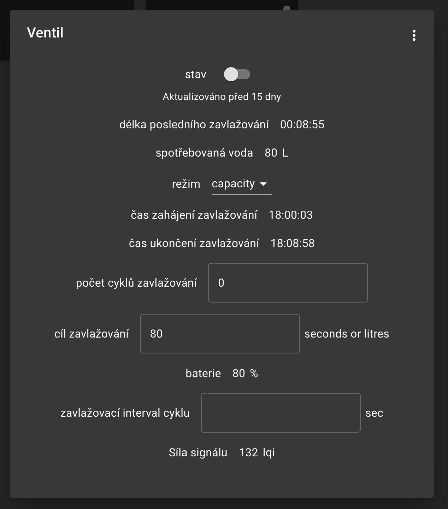

# IOT-Platform-integration

Repository contains bridges, integrations and bots written in Deno for [IoT Platform](https://github.com/founek2/IOT-Platform). It is used to integrate other HW devices which do not support direct connection thus allowing to connect ideally all of your devices to a single platform.

IoT Platform currently does not support any kinds of plugins, so integrations is done via this project - it emulates every device acting as a bridge for communication.

## How to run it

Define whole integration via yaml file. [example.yaml](./example.yaml) contains example configuration for all type of devices and bridges available.

```bash
# Bootstrap config
cp example.yaml config.yaml

# customize all you want
vim config.yaml

# run it
docker run -v ./data:/app/local-storage ./config.yaml:/config.yaml docker-registry.iotdomu.cz/iot-platform/integration
```

## Bridges

Exposing of all devices.

- Frigate (NVR) - integrate all your cameras, show current feed and events (snapshots)
- Zigbee2mqtt - integrate all your Zigbee devices
- Twilio - send sms message as reaction to Mqtt message

## Devices

- Sony bravia TV
  - turn on/off
  - display custom html website
  - change volume
- Samsung TV (Tizen)
  - turn on/off
- Intex whirlpool - integrated via TCP connection to ESP display
  - current and target temperate
  - control: heating, bubbles, nozzles, filtration
- Solax inverter - integrated via Solax Cloud service, since gen X3 does not allow reading of MQTT messages (before it was just plain JSON)
  - Reading of all available values
- Yamaha reciever - [API spec](./_media/yamaha_API_spec.pdf)
  - turn on/off
  - change input
  - change volume
- Prusa 3D printer
- sms

## Docker installation

Docker compose mapping:

```yaml
# Required for UDP sockets to work properly - used for Yamaha, Tizen
network_mode: host
```

## Examples


> Image shows integrated single camera via Frigate



> Image shows integration for Zigbee water valve <https://www.zigbee2mqtt.io/devices/QT06_1.html>

Solax inverter             |  Solax baterry
:-------------------------:|:-------------------------:
 |  

> Integration for Solax X3
